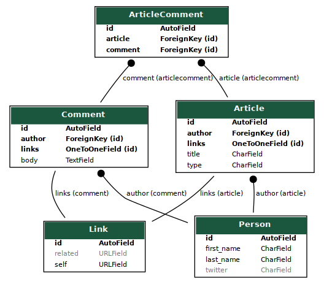
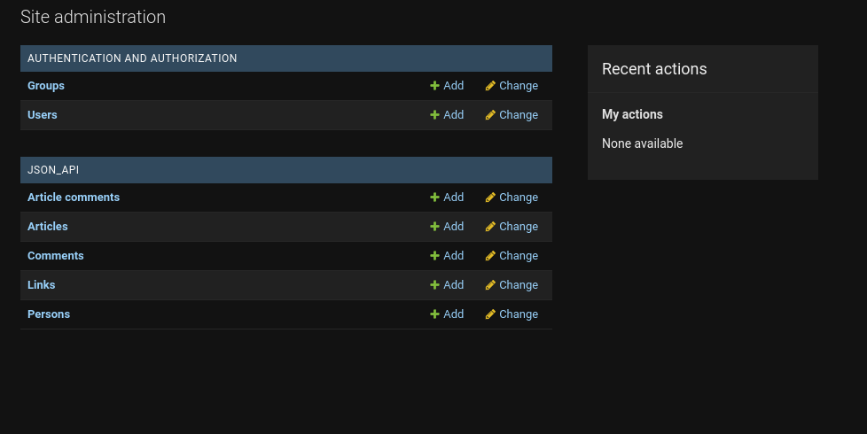
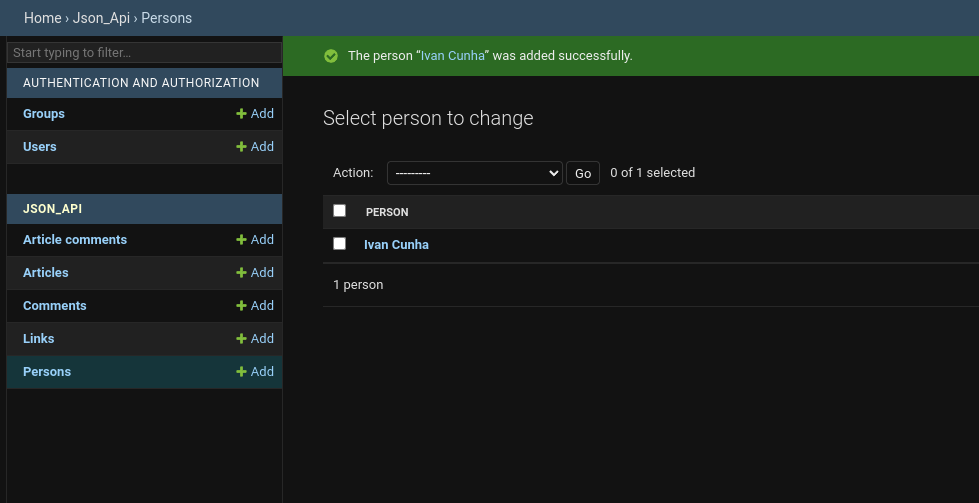

# Database Design - Analyze JSON and Generate Models
This project shows the creation of a database schema based on a json response.

## Schema Creation

The json file `json_api.json` was extracted from the json api website https://jsonapi.org/ and it is just a sample json for demonstration. Based on the fields and relationships encountered, the schema was created

With Django, it is also possible to have access to a admin panel for the database. The main page shows the access control for users and all the tables (models).

For a specific table (model), it is possible to view, edit, add and delete entries.

